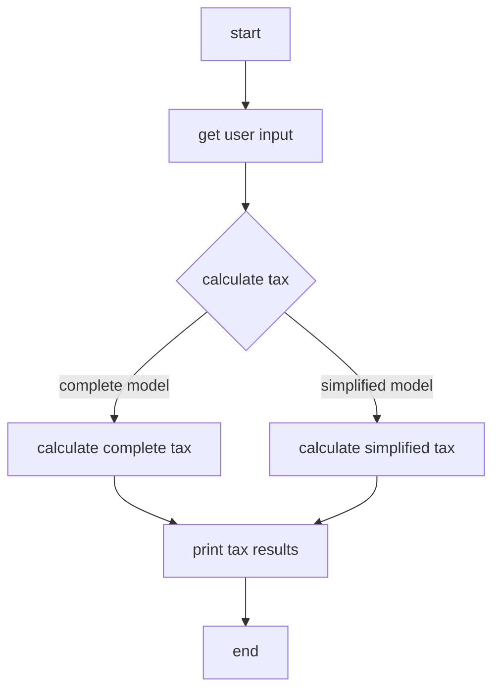

# Brazilian Income Tax Calculator

Calculate Brazilian income tax through a CLI.

## Running the CLI in a container

```sh
docker compose run br_income_tax
```

### Usage example

Once the container is up and running, it will start the application in interactive mode. You can then follow the prompts to enter your income details.

```sh
# Example output:
# This program calculates your Brazilian Income Tax based on your annual income, total deductions, and total tax paid.
# Enter your annual income: 50000
# Enter your total deductions: 2000
# Enter the total tax paid during the year: 5000
# Total Tax Due (Complete Model): 2846.79
# Total Tax Due (Simplified Model): 1422.74
# Tax Difference (Complete Model): -2153.21
# You will be refunded 2153.21 using the Complete Model.
# Tax Difference (Simplified Model): -3577.26
# You will be refunded 3577.26 using the Simplified Model.
```

## Project structure
```plaintext
br_income_tax/
├── Cargo.lock
├── Cargo.toml
├── Dockerfile
├── docker-compose.yml
├── .github/
│   └── workflows/
│       └── ci.yml
└── src/
    ├── main.rs
    ├── tax_calculator.rs
    └── tax_data.rs
```

## Mermaid flowchart

Here is a flowchart representing the flow of the application:


