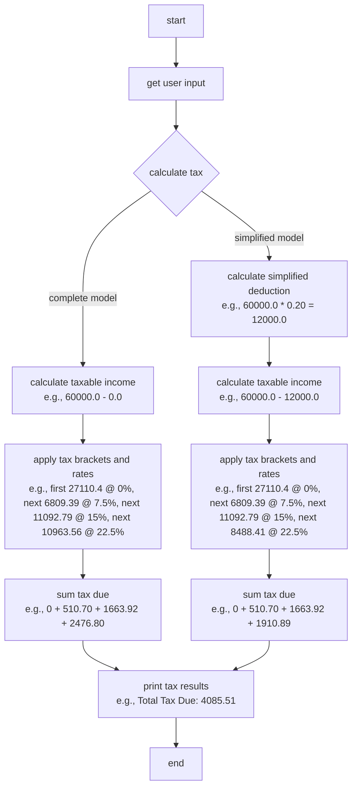

# Brazilian Income Tax Calculator

Ever fancied a trip to the land of jabuticaba, rain forest, and... taxes? Well, now you can experience the pure thrill of being BR anywhere in the world!

Calculate our income tax through a CLI and enjoy the most brazilianistic experience: lots and lots of taxes. Because why should brazilians have all the fun?

## Running the CLI in a container

```sh
docker compose run br_income_tax
```

### Usage example

Once the container is up and running, it will start the application in interactive mode. You can then follow the prompts to enter your income details.

```sh
This program calculates your Brazilian Income Tax based on your annual income, total deductions, and total tax paid.
Enter your annual income (e.g., 50000.00): 4332453
Enter your total deductions (e.g., 2000.00): 314435
Enter the total tax paid during the year (e.g., 5000.00): 24562
Total Tax Due (Complete Model): 1068887.14
Total Tax Due (Simplified Model): 1150749.33
Tax Difference (Complete Model): 1044325.14
Tax Difference (Simplified Model): 1126187.33
You need to pay 1044325.14 more using the Complete Model.
You need to pay 1126187.33 more using the Simplified Model.
```

## Project structure
```plaintext
br_income_tax/
├── Cargo.lock
├── Cargo.toml
├── Dockerfile
├── docker-compose.yml
├── .github/
│   └── workflows/
│       └── ci.yml
└── src/
    ├── main.rs
    ├── tax_calculator.rs
    └── tax_data.rs
```

## Mermaid flowchart

Here is a flowchart representing the flow of the application:


